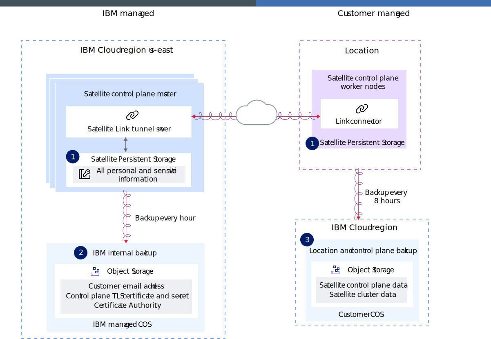

---

copyright:
  years: 2020, 2024
lastupdated: "2024-01-03"

keywords: satellite, hybrid, multicloud, securing your data, secure data, information

subcollection: satellite

---

{{site.data.keyword.attribute-definition-list}}

# Securing your data
{: #data-security}

Review what personal and sensitive information is stored when you use {{site.data.keyword.satellitelong}}, how this data is stored and encrypted, and how you can permanently remove this information.
{: shortdesc}

## What information is stored with {{site.data.keyword.IBM_notm}} with {{site.data.keyword.satelliteshort}}?
{: #sat-sensitive-data}

For every location that you create, {{site.data.keyword.IBM_notm}} stores certain personal and sensitive information. Depending on the type of information, {{site.data.keyword.IBM_notm}} or you are responsible to store this information and protect it. For more information, see [How is my information stored, backed up, and encrypted](#sat-data-encryption)?
{: shortdesc}

### Stored information when you create a {{site.data.keyword.satelliteshort}} location
{: #sat-sensitive-data-default}

The following information is stored when you create a {{site.data.keyword.satelliteshort}} location.

Personal information
:    The email address of the {{site.data.keyword.cloud_notm}} account that created the location.

Sensitive information
:    - The TLS certificate and secret that is used for the assigned {{site.data.keyword.satelliteshort}} control plane domain.
     - The certificate authority that is used for the TLS certificate.
     - An {{site.data.keyword.IBM_notm}}-owned encryption key for each location that is used to encrypt the TLS certificates, secrets, and certificate authority of the {{site.data.keyword.satelliteshort}} control plane domain.
     - {{site.data.keyword.satelliteshort}} control plane and {{site.data.keyword.satelliteshort}} cluster data that can be used to restore the control plane and clusters in a disaster.

### Stored information from resources that you create in {{site.data.keyword.satelliteshort}}
{: #sat-sensitive-data-user-added}

Because {{site.data.keyword.satelliteshort}} is an extension of {{site.data.keyword.cloud_notm}} to your own environment, you create many resources whose metadata might be stored, backed up, and encrypted in {{site.data.keyword.satelliteshort}}.
{: shortdesc}

Do not use sensitive or personally identifiable information for the names, labels, tags, or other metadata for the following items.
{: important}

- {{site.data.keyword.satelliteshort}} resources, such as the names of locations, hosts, {{site.data.keyword.satelliteshort}} Link endpoints, {{site.data.keyword.satelliteshort}} configurations, versions, subscriptions, cluster group names, or storage configurations.
- [{{site.data.keyword.satelliteshort}}-enabled services](/docs/satellite?topic=satellite-managed-services) resources, such as the names of service instances or clusters.
- Managed Kubernetes resources that run in clusters in your {{site.data.keyword.satelliteshort}} location, such as the names and resource definitions of deployments, pods, services, secrets, or config maps.
- The definitions of resources managed by {{site.data.keyword.satelliteshort}} config, including their data. Sensitive keys or personally identifiable information can be managed with {{site.data.keyword.secrets-manager_short}}, or encrypted with {{site.data.keyword.keymanagementserviceshort}}.
- Any other resources that run in your {{site.data.keyword.satelliteshort}} location.

## How is my information stored, backed up, and encrypted with {{site.data.keyword.satelliteshort}}?
{: #sat-data-encryption}

Review the following image to see how your personal and sensitive information is stored, backed up, and encrypted.
{: shortdesc}

{: caption="Figure 1. Satellite data security" caption-side="bottom"}

(1) All personal and sensitive information
:   Review the location, access, backup, and encryption details for personal and sensitive information.
    - **Location**: All data is stored in a {{site.data.keyword.satelliteshort}} persistent storage instance in the location's {{site.data.keyword.satelliteshort}} management plane.
    - **Access and data management**: The persistent storage instance is owned and managed by the {{site.data.keyword.satelliteshort}} control plane service team. You cannot access the data in the persistent storage instance.
    - **Backup**: See 2 and 3 to see how data is backed up.
    - **Encryption**: Data is encrypted at rest with a customer root key from an {{site.data.keyword.IBM_notm}}-owned {{site.data.keyword.keymanagementservicelong_notm}} service instance.
    
(2) TLS certificate, TLS secret, and certificate authority to encrypt the {{site.data.keyword.satelliteshort}} control plane domain
:   Review the location, access, backup, and encryption details for TLS secret and CA information.
    - **Location**: Data is backed up from the {{site.data.keyword.satelliteshort}} persistent storage instance to an {{site.data.keyword.IBM_notm}}-owned {{site.data.keyword.cos_full_notm}} instance.
    - **Access and data management**: Access to the {{site.data.keyword.IBM_notm}}-owned {{site.data.keyword.cos_full_notm}} service instance is controlled by {{site.data.keyword.iamshort}} (IAM) and granted to the {{site.data.keyword.satelliteshort}} service team and {{site.data.keyword.IBM_notm}} Site Reliability Engineers (SRE) only.
    - **Backup**: Every hour
    - **Encryption**: All backup data is protected in transit and at rest by a root key that {{site.data.keyword.IBM_notm}} creates and stores in an {{site.data.keyword.IBM_notm}}-owned {{site.data.keyword.keymanagementservicelong_notm}} service instance.
    
(3) All {{site.data.keyword.satelliteshort}} control plane and cluster data
:   Review the location, access, backup, and encryption details for control plane and cluster data.
    - **Location**: Cluster data such as etcd data is backed up from the {{site.data.keyword.satelliteshort}} persistent storage instance to a customer-owned {{site.data.keyword.cos_full_notm}} instance. Control plane data such as location data is sent to the {{site.data.keyword.cos_full_notm}}. You must have an existing {{site.data.keyword.cos_full_notm}} instance when you create the location. You can specify an existing bucket in the {{site.data.keyword.cos_full_notm}} instance that you want {{site.data.keyword.satelliteshort}} to use. Otherwise, a new bucket is automatically created in your {{site.data.keyword.cos_short}} instance on your behalf. management plane data is backed up by {{site.data.keyword.IBM_notm}} and stored in an {{site.data.keyword.IBM_notm}}-owned {{site.data.keyword.cos_short}} instance. {{site.data.keyword.satelliteshort}} cluster master data is backed up to the {{site.data.keyword.cos_short}} instance that you own.
    - **Access and data management**: Access to the customer-owned {{site.data.keyword.cos_full_notm}} service instance is controlled by IAM.
    - **etcd Backup**: Every 8 hours
    - **Location control plane Backup**: Every hour
    - **Encryption**: Data is automatically encrypted by using the default built-in encryption mechanisms in {{site.data.keyword.cos_full_notm}}. You can further choose to protect your data by using a root key in {{site.data.keyword.keymanagementservicelong_notm}} and use the key to encrypt the data in your bucket. For more information, see the [{{site.data.keyword.cos_full_notm}} documentation](/docs/cloud-object-storage?topic=cloud-object-storage-encryption).

The time to recover a location or cluster depends on the size of the location or cluster and the network latency between {{site.data.keyword.cloud_notm}} and your host infrastructure. 
{: note}

## Where can I find information about the data that my managed services store?
{: #managed-services-data}

You can find information about the data that is stored by your managed service by reading the data security topic for each service.

## Which {{site.data.keyword.cloud_notm}} region is my information stored in?
{: #sat_data-location}

Where your {{site.data.keyword.satelliteshort}} information is stored depends on the {{site.data.keyword.cloud_notm}} region that manages the control plane of your {{site.data.keyword.satelliteshort}} location. By selecting the {{site.data.keyword.cloud_notm}} region that is closest to the infrastructure provider for your {{site.data.keyword.satelliteshort}} location, your data is automatically spread across zones in that region for high availability. Because the zones of an {{site.data.keyword.cloud_notm}} region might be in a different city or country than the infrastructure hosts that you bring to your {{site.data.keyword.satelliteshort}} location, make sure that your data can be stored in the selected {{site.data.keyword.cloud_notm}} region.

## How can I remove my information?
{: #sat-data-removal}

Review your options to remove your personal and sensitive information from {{site.data.keyword.satellitelong_notm}}.
{: shortdesc}

Removing personal and sensitive information is permanent and cannot be undone. Make sure that you want to permanently remove your information before you proceed.
{: important}

[Deleting a location](/docs/satellite?topic=satellite-host-remove#location-remove-console) does not remove all information from {{site.data.keyword.satellitelong_notm}}. When you delete a location, location-specific information is removed from the etcd instance that is managed by {{site.data.keyword.IBM_notm}}. However, your information still exists in the following places.

- **Data that {{site.data.keyword.IBM_notm}} manages**: A backup of the {{site.data.keyword.satelliteshort}} location is in {{site.data.keyword.cos_full_notm}} and can still be accessed by the {{site.data.keyword.IBM_notm}} service team. To remove all data that {{site.data.keyword.IBM_notm}} stores, choose between the following options. Note that removing your personal and sensitive information requires all your {{site.data.keyword.satelliteshort}} locations to be deleted as well. Make sure that you backed up your data before your proceed.

    - **Open an {{site.data.keyword.cloud_notm}} support case**: Contact {{site.data.keyword.IBM_notm}} Support to remove your personal and sensitive information from {{site.data.keyword.satellitelong_notm}}. For more information, see [Getting support](/docs/get-support?topic=get-support-using-avatar).
    
    - **End your {{site.data.keyword.cloud_notm}} subscription**: After you end your {{site.data.keyword.cloud_notm}} subscription, all personal and sensitive information is permanently removed.
    
- **Cluster data in {{site.data.keyword.cos_full_notm}}**: When you create a {{site.data.keyword.openshiftlong_notm}} cluster, some cluster data is backed up to an {{site.data.keyword.cos_short}} instance in your account. To delete the data, review the [{{site.data.keyword.cos_short}} documentation](/docs/cloud-object-storage?topic=cloud-object-storage-security).

- **Cluster data on the local host**: Because the cluster masters run on your {{site.data.keyword.satelliteshort}} location control plane hosts, the data is still available on the physical hosts in your infrastructure provider after you delete the {{site.data.keyword.satelliteshort}} location. To delete the data, consult your infrastructure provider documentation to reload the operating system or delete the host.

