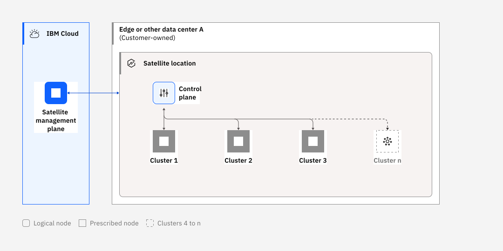
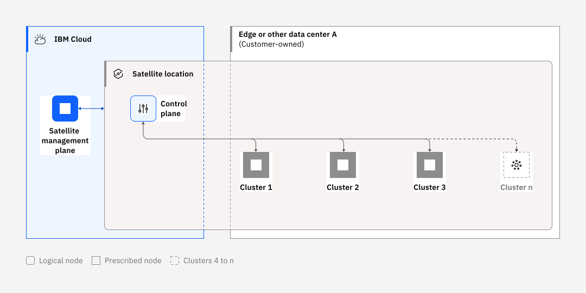
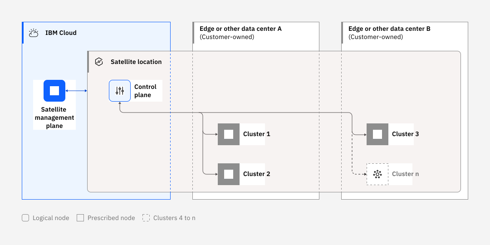
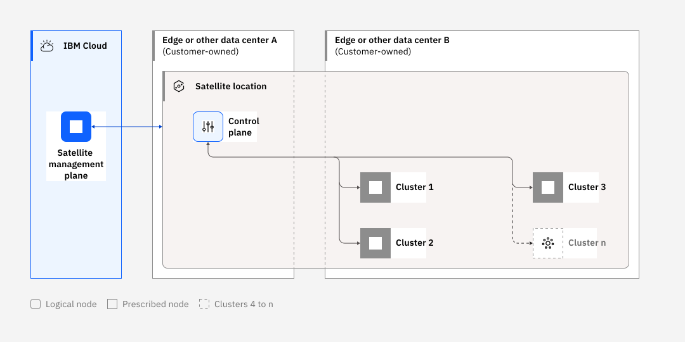
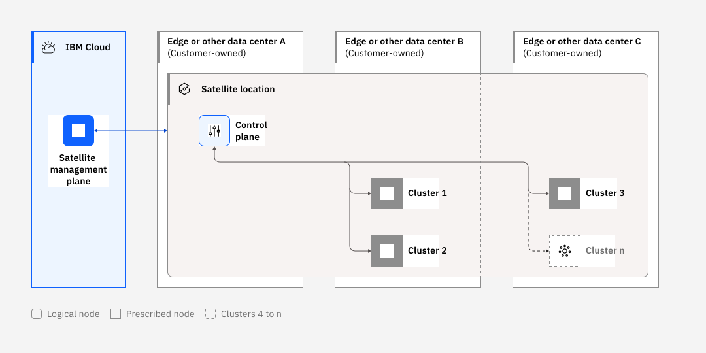

---

copyright:
  years: 2022, 2024
lastupdated: "2024-01-30"

keywords: satellite, multicloud, location, locations, control plane, remote workers

subcollection: satellite

---

{{site.data.keyword.attribute-definition-list}}

# Setting up a {{site.data.keyword.satelliteshort}} location with remote workers
{: #sat-multi-infra}

By using the flexible architecture of {{site.data.keyword.satelliteshort}}, you can assign workload hosts to a location from a single provider or from multiple providers. You can also create worker nodes in separate networks from the {{site.data.keyword.satelliteshort}} control plane to support edge and remote use cases. Find out how to plan and create {{site.data.keyword.satelliteshort}} locations with multiple infrastructure providers.
{: shortdesc} 

## Infrastructure composition options and supported topologies
{: #infra-topologies}

The following figures show the supported topologies. 
{: shortdesc} 

In each case, communication flows between the {{site.data.keyword.satelliteshort}} control plane and the service clusters. The {{site.data.keyword.satelliteshort}} management plane communicates with the {{site.data.keyword.satelliteshort}} control plane. This communication must be enabled for {{site.data.keyword.satelliteshort}} to work normally.

When you set up {{site.data.keyword.satelliteshort}} locations with multiple infrastructure providers, consider the following points.

- Attach all the hosts with the attach script method. Schematics for third-party cloud providers cannot be used in this case.
- A single cluster (and the location control plane) inside a {{site.data.keyword.satelliteshort}} location must use a single infrastructure provider.
- The infrastructure that is used for the {{site.data.keyword.satelliteshort}} location must meet all the host and network related requirements.

### Example 1: Compute hosts are located in a single edge or data center
{: #compute-hosts-third-party}

In this example, the compute resources are located in a data center or edge. IBM manages the {{site.data.keyword.satelliteshort}} management plane, but the hosts that make up the location, including the control plane and the hosts required for your services are on customer-owned infrastructure.

{: caption="Figure 1. Compute hosts from third-party infrastructure provider" caption-side="bottom"}

### Example 2: Compute hosts are located in {{site.data.keyword.cloud_notm}} and edge or data centers
{: #compute-hosts-ibmcloud}

In this example, the compute resources are located in both {{site.data.keyword.cloud_notm}} and any one of the supported infrastructure providers or edge. The hosts that make up the control plane are from {{site.data.keyword.cloud_notm}}, but the hosts that make up the services are located in separate, customer-owned edge or infrastructure providers. Note that while you can use other {{site.data.keyword.cloud_notm}} virtual servers, such as {{site.data.keyword.vsi_is_short}} for test environments, the only supported {{site.data.keyword.cloud_notm}} infrastructure to use in {{site.data.keyword.satellitelong}} for production environments is {{site.data.keyword.baremetal_long}} for Classic that is running Red Hat CoreOS.

{: caption="Figure 2. Compute hosts from IBM Cloud and other edge or infrastructure provider" caption-side="bottom"}

### Example 3: Compute hosts are located in {{site.data.keyword.cloud_notm}} and multiple data centers or edge
{: #compute-hosts-ibmcloud-multiple}

In this example, the compute resources are located in both {{site.data.keyword.cloud_notm}} and in multiple data center or edge. The hosts that make up the control plane are from {{site.data.keyword.cloud_notm}}, but the hosts that make up the services are located multiple other customer-owned edge or infrastructure providers. Note that while you can use other {{site.data.keyword.cloud_notm}} virtual servers, such as {{site.data.keyword.vsi_is_short}} for test environments, the only supported {{site.data.keyword.cloud_notm}} infrastructure to use in {{site.data.keyword.satellitelong}} for production environments is {{site.data.keyword.baremetal_long}} for Classic that is running Red Hat CoreOS.

{: caption="Figure 3. Compute hosts in both IBM Cloud and different edge or data centers" caption-side="bottom"}

### Example 4: Compute hosts are located in multiple edge or data centers
{: #compute-hosts-multiple}

In this example, the compute resources are located in multiple data centers or edge. IBM manages the {{site.data.keyword.satelliteshort}} management plane, but the hosts that make up the location, including the control plane and the hosts required for your services are on customer-owned infrastructure.

{: caption="Figure 4. Compute hosts in different edge or data centers" caption-side="bottom"}

### Example 5: Compute hosts, including {{site.data.keyword.satelliteshort}} control plane, are located in multiple edge or data centers
{: #compute-hosts-cp-multiple}

In this example, the compute resources are located in multiple data centers or edge. The {{site.data.keyword.satelliteshort}} control plane is located in a single data center or edge, while the hosts required for your services are on separate data centers or edge.

{: caption="Figure 5. Compute hosts from nultiple, separate edge or data centers" caption-side="bottom"}

## Use case: Edge clusters with centralized management in {{site.data.keyword.cloud_notm}}
{: #edge-cluster}

This use case shows how to build a centralized management plane for your {{site.data.keyword.satelliteshort}} location inside {{site.data.keyword.cloud_notm}}, while the managed {{site.data.keyword.satelliteshort}} clusters are on the edge, in any other data centers, or in third-party clouds.

Follow these steps to set up your {{site.data.keyword.satelliteshort}} location.

1. Create a {{site.data.keyword.satelliteshort}} location manually. See [Manually creating {{site.data.keyword.satelliteshort}} locations](/docs/satellite?topic=satellite-loc-manual-create).
2. Download the host attach script.
3. Provision the infrastructure hosts inside {{site.data.keyword.cloud_notm}} with the attach script. See [Adding {{site.data.keyword.cloud_notm}} hosts to {{site.data.keyword.satelliteshort}} manually](/docs/satellite?topic=satellite-ibm#ibm-host-attach).
4. Provision the edge compute hosts for the {{site.data.keyword.satelliteshort}} clusters with the same attach script.
5. Confirm all your hosts from all providers are available and unassigned in the {{site.data.keyword.satelliteshort}} location.
6. Assign {{site.data.keyword.satelliteshort}} location control plane hosts. Use your hosts from {{site.data.keyword.cloud_notm}} according to [Setting up the Satellite location control plane](/docs/satellite?topic=satellite-setup-control-plane).
7. Confirm that the {{site.data.keyword.satelliteshort}} location control plane is in a healthy state.
8. Create a new {{site.data.keyword.redhat_openshift_notm}} cluster on your {{site.data.keyword.satelliteshort}} location by using your remaining compute hosts on the edge. See [Creating {{site.data.keyword.redhat_openshift_notm}} clusters in {{site.data.keyword.satelliteshort}}](/docs/openshift?topic=openshift-satellite-clusters).

