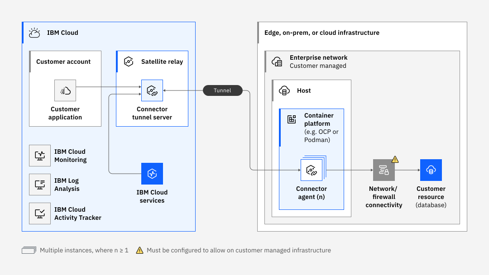

---

copyright:
  years: 2023, 2024
lastupdated: "2024-04-17"

keywords: satellite, connector, agent

subcollection: satellite

---

{{site.data.keyword.attribute-definition-list}}

# {{site.data.keyword.satelliteshort}} Connector overview
{: #understand-connectors}

{{site.data.keyword.satelliteshort}} Connector provides secure TLS tunneling between applications and services that need to communicate in hybrid and multi-cloud environments.
{: shortdesc}

  
{{site.data.keyword.satelliteshort}} Connector allows hybrid cloud connectivity for edge devices needing persistent connectivity. It enables advertising of trusted services that are capable of establishing secure end-point connectivity. With {{site.data.keyword.satelliteshort}} Connector, you can maintain data sovereignty with on-premises applications and services while connecting securely over a public network interface.

{: caption="Figure 1. {{site.data.keyword.satelliteshort}} Connector" caption-side="bottom"}
  
A {{site.data.keyword.satelliteshort}} Connector is a deployment model that enables only the secure communications from {{site.data.keyword.cloud_notm}} to on-prem resources with a light-weight container that is deployed on your container platform hosts, such as Docker hosts. This option brings all the security and auditability of {{site.data.keyword.satelliteshort}} communication, but with fewer resources required.
  
Here are some key concepts for {{site.data.keyword.satelliteshort}} Connector.
  
Connector {: #term-connector}
:   A connector provides a secure connection between a specific remote location and {{site.data.keyword.cloud_notm}}.
  
Agent {: #term-agent}
:   Each connector needs an agent running on your location to establish the connection.
  
Endpoint {: #term-endpoint}
:   An endpoint is the Connector term for the service being accessed across the Connector service. Endpoints are either the FQDNs or the IP addresses of the resources being made available across Satellite Connector. An endpoint is not limited to http(s) traffic, but can be any protocol that works across a TCP connection.
  
Access control list {: #term-acl}
:   Because endpoints are exposed privately within IBM cloud to all IBM cloud, including other customers, an ACL allows for the IP or CIDR definitions of which resources in IBM cloud are allowed to use the endpoint.

## Minimum requirements
{: #min-requirements}

These minimum requirements are for running the agent image only and exclude what's needed to run the container platform.
{: note}
  
To run the {{site.data.keyword.satelliteshort}} Connector agent image, your computing environment must meet the following minimum requirements.
- CPU: 0.40
- Memory: 500M
- Container platform must be on x86 architecture.
- The Connector agent image is for x86 architecture and only runs on x86 hardware or hardware that can emulate x86. If you are on a Mac with Apple Silicon (arm64), the image works if Rosetta is installed. If Rosetta is not installed on your Mac, you can install it via the `softwareupdate --install-rosetta` command.
- The Connector agent for Windows supports Windows 10 and Windows Server 2016.

## Network requirements
{: #network-requirements}

To pull the {{site.data.keyword.satelliteshort}} Connector agent image, you must allow the following connection so that hosts can communicate with {{site.data.keyword.registrylong_notm}}.
- Destination IP addresses: N/A 
- Destination hostnames: `icr.io` 
- Protocol and ports: HTTPS 443 

The {{site.data.keyword.satelliteshort}} Connector agent that runs in your environment needs public outbound connectivity to {{site.data.keyword.cloud_notm}}. This can be direct public access or via a proxy. There is no requirement for public inbound access. See the [Configuring a proxy for your {{site.data.keyword.satelliteshort}} Connector](/docs/satellite?topic=satellite-config-connector-proxy) for more information about using a proxy. The list of endpoints, including URLs and IP Addresses, that must be outbound accessible depends on the region you specified when creating the {{site.data.keyword.satelliteshort}} Connector. See the entry for your region in the following list.

Dallas
:    * Destination IP addresses: 169.46.88.106, 169.61.31.178, 169.61.156.226
     * Destination hostnames: `c-01-ws.us-south.link.satellite.cloud.ibm.com`, `api.link.satellite.cloud.ibm.com`
     * Protocol and ports: HTTPS 443

Frankfurt
:    * Destination IP addresses: 149.81.188.130, 158.177.75.210, 161.156.38.2  
     * Destination hostnames:  `c-01-ws.eu-de.link.satellite.cloud.ibm.com`, `api.link.satellite.cloud.ibm.com`
     * Protocol and ports: HTTPS 443

London
:    * Destination IP addresses: 158.175.130.138, 141.125.87.226, 158.176.74.242
     * Destination hostnames: `c-01-ws.eu-gb.link.satellite.cloud.ibm.com`, `api.link.satellite.cloud.ibm.com`
     * Protocol and ports: HTTPS 443
     
Osaka
:    * Destination IP addresses: 163.68.78.234, 163.69.70.106, 163.73.70.50
     * Destination hostnames: `c-01-ws.jp-osa.link.satellite.cloud.ibm.com`, `api.link.satellite.cloud.ibm.com`
     * Protocol and ports: HTTPS 443

Sao Paulo
:    * Destination IP addresses: 163.107.69.114, 163.109.70.234, 169.57.155.74 
     * Destination hostnames: `c-01-ws.br-sao.link.satellite.cloud.ibm.com`, `api.link.satellite.cloud.ibm.com`
     * Protocol and ports: HTTPS 443

Sydney
:    * Destination IP addresses: 130.198.75.74, 135.90.67.154, 168.1.201.194
     * Destination hostnames: `c-01-ws.au-syd.link.satellite.cloud.ibm.com`, `api.link.satellite.cloud.ibm.com`
     * Protocol and ports: HTTPS 443
     
Tokyo
:    * Destination IP addresses: 161.202.150.66, 128.168.89.146, 165.192.71.226
     * Destination hostnames: `c-01-ws.jp-tok.link.satellite.cloud.ibm.com`, `api.link.satellite.cloud.ibm.com`
     * Protocol and ports: HTTPS 443

Toronto
:    * Destination IP addresses: 163.74.67.114, 163.75.70.74, 158.85.79.18
     * Destination hostnames: `c-01-ws.ca-tor.link.satellite.cloud.ibm.com`, `api.link.satellite.cloud.ibm.com`
     * Protocol and ports: HTTPS 443

Washington D.C.
:    * Destination IP addresses: 169.47.156.154, 169.63.148.250, 169.62.1.34
     * Destination hostnames: `c-01-ws.us-east.link.satellite.cloud.ibm.com`, `api.link.satellite.cloud.ibm.com`
     * Protocol and ports: HTTPS 443

## Next steps
{: #connector-understand-next-steps}

- [Create a Connector](/docs/satellite?topic=satellite-create-connector)
- [Running a Connector agent](/docs/satellite?topic=satellite-run-agent-locally)
- [Running your Connector agent as a service in Docker Swarm Mode for high availability](/docs/satellite?topic=satellite-run-agent-swarm)
- [{{site.data.keyword.satelliteshort}} Connector end-to-end example](/docs/satellite?topic=satellite-end-to-end)

