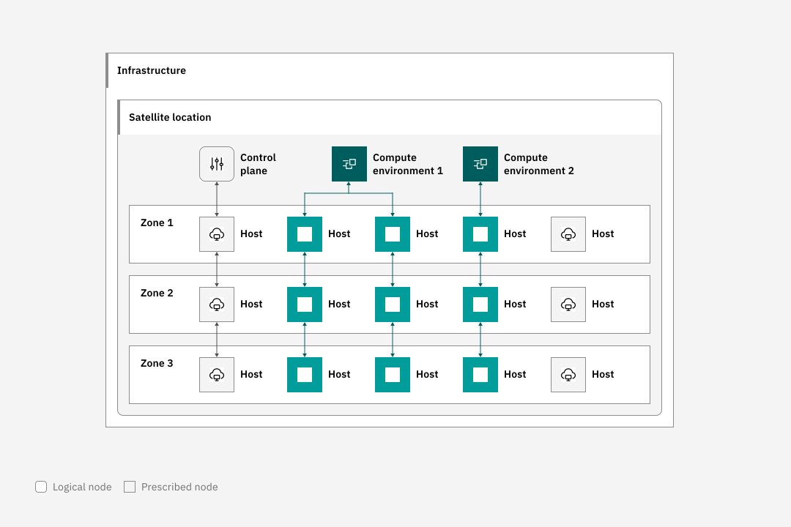

---

copyright:
  years: 2022, 2023
lastupdated: "2023-09-20"

keywords: workloads, location, compute environment, code engine

subcollection: codeengine

---

{{site.data.keyword.attribute-definition-list}}

# Getting started with {{site.data.keyword.codeengineshort}} workloads in {{site.data.keyword.satelliteshort}}
{: #satellite-ce}

With {{site.data.keyword.codeenginefull}} on {{site.data.keyword.satellitelong_notm}}, you can run your apps and jobs in a distributed cloud environment, bringing the scalability and flexibility of public cloud services to your secure private cloud. Use your own compute infrastructure in your on-premises data center, edge networks, or other supported cloud providers to create your {{site.data.keyword.satelliteshort}} location and to power your workloads. By combining the capabilities of {{site.data.keyword.codeengineshort}} and {{site.data.keyword.satelliteshort}}, you can consistently deploy, manage, and control your workloads from a single pane of glass across your infrastructure.
{: shortdesc}

Support for {{site.data.keyword.codeengineshort}} workloads in {{site.data.keyword.satelliteshort}} is currently in Beta and available for allowlisted accounts only. To take part in the Beta, contact support by [opening a case](https://cloud.ibm.com/unifiedsupport/cases/form){: external}. Select `Application Development & Integration -> Code Engine -> Other`. Enter "Request access to Beta" in issue subject. Compute environments and their contents, including projects, secrets, apps, jobs, and job runs that you create during Beta might be reset and will be removed at the end of Beta. Do not use for production. 
{: beta}

To use {{site.data.keyword.codeengineshort}} on {{site.data.keyword.satelliteshort}}, you must first create a compute environment in a {{site.data.keyword.satelliteshort}} location. From within this compute environment, you can deploy apps and run jobs from your own infrastructure. For more information about {{site.data.keyword.satelliteshort}}, see [Getting started with {{site.data.keyword.satelliteshort}}](/docs/satellite?topic=satellite-getting-started).

{: caption="Figure 1. Code Engine workloads in Satellite overview" caption-side="bottom"}

## Limitations for Beta
{: #satellite-ce-beta-limits}

- Supported in the `eu-de` region only.
- No support for building images from source.
- No support for subscriptions.
- No support for SOC2.
- No support for {{site.data.keyword.framework-fs_notm}} validation.
- No support for autoscaling your nodes.
- No logs or monitoring metrics are collected. 
- No support for private endpoints.
- If you use service binding, you must set up your bind through the UI and the service you are binding to must be accessible from your {{site.data.keyword.satelliteshort}} location.
- No support for {{site.data.keyword.codeengineshort}} CLI. You must create and access your compute environment from the {{site.data.keyword.codeengineshort}} console.

To request inclusion to the allowlist for {{site.data.keyword.codeengineshort}} on {{site.data.keyword.satelliteshort}}, you must contact support by [opening a case](https://cloud.ibm.com/unifiedsupport/cases/form){: external}.

After your create your compute environment, the {{site.data.keyword.satelliteshort}} location includes a link to the cluster; however, you cannot access it directly.
{: note}

## Prerequisites for running {{site.data.keyword.codeengineshort}} workloads in {{site.data.keyword.satelliteshort}}
{: #satellite-ce-prereqs}

Before you begin, set up your Satellite location, label your hosts, and meet your minimum host requirements.

- Verify that your infrastructure meets the [minimum host requirements](/docs/satellite?topic=satellite-host-reqs) for {{site.data.keyword.satelliteshort}}.
- Create a [{{site.data.keyword.satelliteshort}} location](/docs/satellite?topic=satellite-locations).
- Label the hosts to use for {{site.data.keyword.codeengineshort}} with the `env:codeengine` label. For more information, see [Assigning hosts with host auto assignment](/docs/satellite?topic=satellite-host-autoassign-ov).
- Plan to assign at least 6 hosts to use for {{site.data.keyword.codeengineshort}}. Each host must be at least 8 CPUs and 32 GB memory.
- To be highly available, your hosts must be in 3 different zones, depending on what is available in your location.
- To allow your app to be accessed from the public internet, be sure that your {{site.data.keyword.satelliteshort}} hosts are accessible from the public internet. For more information, see [Why can't I access my app?](#ts-sat-ce-app-access).
- In addition to the [minimum host requirements](/docs/satellite?topic=satellite-host-reqs), your {{site.data.keyword.satelliteshort}} hosts must have access to port `1194` on the following public IP addresses. This network access is needed to secure and monitor the compute environment.
    - 169.54.235.52
    - 169.54.235.53


## Setting up service-to-service access
{: #satellite-ce-authority}

To use {{site.data.keyword.codeengineshort}} workloads in {{site.data.keyword.satelliteshort}}, you must have the following permissions.

- You must have IAM **Viewer** authority for the resource group where you want your compute environment.
- To create a compute environment, you must have IAM **Compute Environment Administrator** authority.
- To create a project within a compute environment, you must have at least **Editor** platform role and **Writer** or **Manager** service role.

You do not need access to the {{site.data.keyword.satelliteshort}} location as long as the {{site.data.keyword.codeengineshort}} service is authorized to {{site.data.keyword.satelliteshort}}. To set up your service to service access, follow these steps.

1. Open [Manage authorizations](https://cloud.ibm.com/iam/authorizations){: external} in the IBM Cloud console.
2. Click **Create**.
3. Select the account for the authorization.
4. For **Source service**, select `{{site.data.keyword.codeengineshort}}`. For Beta, scope the access to **All resources**. 
5. For **Target service**, select `{{site.data.keyword.satelliteshort}}`. For Beta, scope the access to **All resources**.
6. Select **Satellite Cluster Creator**, **Satellite Link Administrator**, and **Satellite Link Source Access Controller** as the **Service access**.
7. Click **Authorize**. 

For more information, see [Managing user access in {{site.data.keyword.codeengineshort}}](/docs/codeengine?topic=codeengine-iam) and [Managing access in Satellite](/docs/satellite?topic=satellite-iam).

## Setting up {{site.data.keyword.codeengineshort}} on {{site.data.keyword.satelliteshort}}
{: #satellite-ce-setup}

Before you begin, be sure to [complete all the prerequisites](#satellite-ce-prereqs).

To set up {{site.data.keyword.codeengineshort}} in a {{site.data.keyword.satelliteshort}} location,

1. In the [{{site.data.keyword.codeengineshort}}](https://cloud.ibm.com/codeengine/overview){: external} console, select **Compute Environment**.
2. Click **Create**.
3. Select a {{site.data.keyword.satelliteshort}} location to use for your compute environment.
4. Select the zones and worker nodes per zone for your compute environment. For more information about zones, see [Plan for a multizone location](/docs/satellite?topic=satellite-infrastructure-plan#infra-plan-multizone).
5. Select a region. For Beta, you must select `eu-de`.
6. Name your compute environment.
7. Click **Create**.

After your compute environment is set up, you can create a project and start deploying apps and running jobs. 

Even though CLI commands are available for projects, apps and jobs, you must use the UI for these tasks when you select a project from a {{site.data.keyword.satelliteshort}} compute environment.
{: note}

## Creating a project in a compute environment
{: #satellite-ce-project}

When you create a project, it is automatically selected as the current context. Note that you must create your project from the UI as you cannot select your compute environment from the CLI. To create a project in a compute environment, follow these steps.

1. From the [Projects page on the {{site.data.keyword.codeengineshort}} console](https://cloud.ibm.com/codeengine/projects){: external}, click **Create**. 
2. Select **Satellite** as your platform.
3. Choose a location to deploy the project. 
4. Enter a name for the project. The name must be unique for all your projects within the specified location.
5. Choose the resource group where you want to create the project.
6. Click **Create**.

After your project is created, you can start deploying apps and running jobs in your {{site.data.keyword.satelliteshort}} location.

## Why doesn't my compute environment create?
{: #ts-sat-ce-envir-create}


1. Verify that you set up service-to-service access. [Follow the steps](#satellite-ce-authority) to set it up. Because {{site.data.keyword.codeengineshort}} continuously polls {{site.data.keyword.satelliteshort}} for the assigned location, as soon as you set up service-to-service access, the compute environment creation process continues.
2. Verify that you added the `env:codeengine` label to your {{site.data.keyword.satelliteshort}} hosts. 
    1. Go to [{{site.data.keyword.satelliteshort}} location](https://cloud.ibm.com/satellite/locations){: external}.
    2. Select the Satellite location that you want to use for your compute environment. 
    3. Click **Hosts**. 
    4. Look at the `labels` field for the hosts that you want to use for {{site.data.keyword.codeengineshort}}. If they do not have the `env:codeengine` label, then [follow the instructions](/docs/satellite?topic=satellite-host-autoassign-ov) to add host labels.

## Why can't I access my app?
{: #ts-sat-ce-app-access}

Your {{site.data.keyword.codeengineshort}} app uses the primary network interfaces from your {{site.data.keyword.satelliteshort}} hosts. If the IP addresses for these interfaces are not publicly accessible, then your app is available only from the private network.

To find the IP address that your application uses, follow these steps.

1. Find the domain for your application on the **Application details** page. Look for the **`Public URL`** field under **Endpoints**. 

2. Use a DNS lookup tool (for example, `dig` or `nslookup`) to find the IP addresses used by this domain. For example, 

    ```sh
    dig myapp-abcdefg.ce-abc1abcd23efghijklmn-4o5ddc1a6fde0ec0aebe4cf134f8c000-0000.eu-de.containers.appdomain.cloud A +short
    ```
    {: pre}
    
    The **`dig`** command returns information similar to the following example. Your IP addresses are different, depending on the domain that your app is assigned.
    
    ```sh
    10.0.2.244
    10.0.3.19
    10.0.1.148
    ```
    {: screen}

To access your application, the browser or client must to be able to reach these IP addresses. If these IP addresses are private, then the application is accessible only on that private network.


